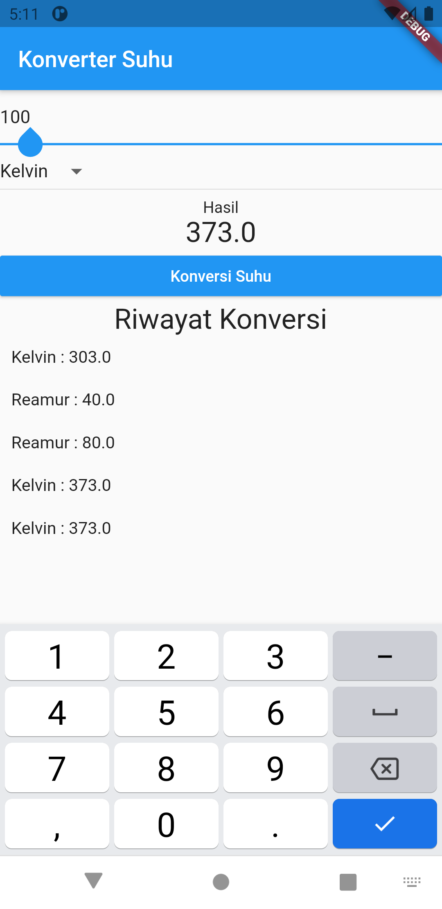

# termometer2

Praktikum Modul 3 Konverter Suhu

# Identitas Mahasiswa

Dionisius D. Yapenrui  
1931710111  
MI-2B

## Screenshoot

## Langkah pengerjaan

1. Analisis UI
2. Penyusunan tata letak berdasarkan widget tree
3. Pengerjaan masing-masing widget dan atur tampilan
4. Pembuatan variable dan function
5. Pemecahan widget menjadi lebih kecil

## Getting Started

This project is a starting point for a Flutter application.

A few resources to get you started if this is your first Flutter project:

- [Lab: Write your first Flutter app](https://flutter.dev/docs/get-started/codelab)
- [Cookbook: Useful Flutter samples](https://flutter.dev/docs/cookbook)

For help getting started with Flutter, view our
[online documentation](https://flutter.dev/docs), which offers tutorials,
samples, guidance on mobile development, and a full API reference.
